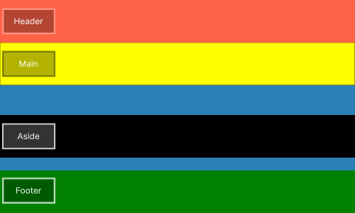

## :books: Exemplo 1

Nesse exemplo foi usado as seguintes propriedades:

### :package: Grid Container

    
    :heavy_check_mark: Grid-template-columns; 
    :heavy_check_mark: Grid-template-rows;           

---

### :art: Imagem exemplo 1

d