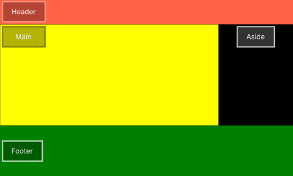
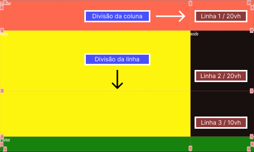

# :books: Exemplo 1 :gear:

<p>Nesse exemplo foi usado as seguintes propriedades:</p>
<p>    
    :heavy_check_mark: Grid-template-columns;<br>
    :heavy_check_mark: grid-column-start;<br>
    :heavy_check_mark: grid-column-end;<br>
    :heavy_check_mark: Grid-row-start;<br>
    :heavy_check_mark: Grid-row-end;<br>       
</p>

---






## :mag_right: HTML / CSS


```html
# Estrutura do HTML
<!DOCTYPE html>
<html lang="en">
<head>
    <meta charset="UTF-8">
    <meta name="viewport" content="width=device-width, initial-scale=1.0">
    <title>Document</title>
    <link rel="stylesheet" href="style.css">
</head>
<body>
    <div class="container">
        <header>Header</header>
        <main>Main</main>
        <aside>Aside</aside>
        <footer>Footer</footer>
    </div>
</body>
</html>       
	
```

```css
# Folha de estilo CSS
* {
    margin: 0;
    padding: 0;
    outline: 0;
    box-sizing: border-box;
    background:#0077FF;    
}
html {
    font-size: 62.5%;
}
.container {
    display: grid;    
    grid-template-columns:3fr 1fr;
    grid-template-rows:20vh 40vh 30vh 10vh;          
    color:#FFF;    
    font-size: 2rem;
}
header {
    grid-column-start:1;
    grid-column-end:3;
    background-color: #ff6347;
    height:auto;   
    
}
main {
    grid-column-start:1;
    grid-column-end:2;
    grid-row-start:2;
    grid-row-end:4;
    height:auto;  
    color:#000;    
    background-color:#ffff00;
    
}
aside {
    height:auto;
    background-color:black;    
    grid-row-start:2;
    grid-row-end:4;

}
footer {
    grid-column-start:1;
    grid-column-end:3;
    height:auto;
    background-color:#008000;
}   	
```