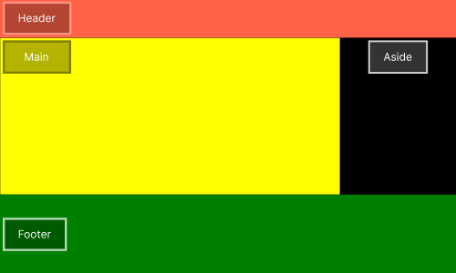
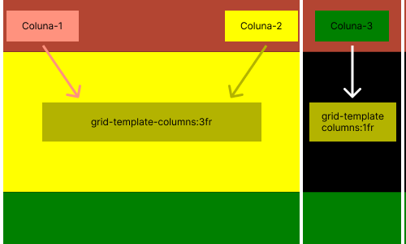

# :books: Exemplo 1.1

Nesse exemplo foi usado as seguintes propriedades:

    
    :heavy_check_mark: Grid-template-columns; 
    :heavy_check_mark: Grid-template-rows;           

---

## :art: Imagem 

### Exemplo 1.1
#### :package: Container ilustrativo

### Exemplo 1.2

#### :package: Container com :classical_building: 2 colunas

