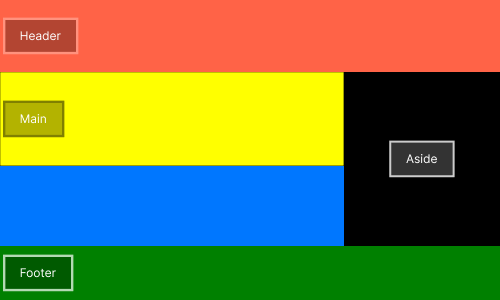
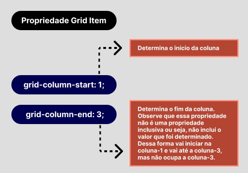
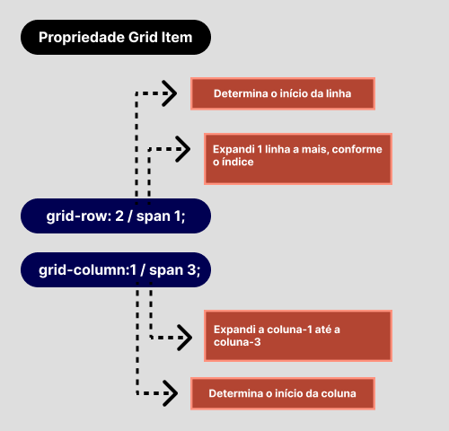

# :books: Exemplo 1.2

Nesse exemplo foi usado as seguintes propriedades:

## :package: Grid Container

    
    :heavy_check_mark: Grid-template-columns; 
    :heavy_check_mark: Grid-template-rows;           

## :pencil: Grid Item

        
    :heavy_check_mark: Grid-column-start;     
    :heavy_check_mark: Grid-column-end;     
    :heavy_check_mark: Grid-row-start;     
    :heavy_check_mark: Grid-row-end;     

---

## :art: Imagem 

### Exemplo 1.2
#### :package: Container ilustrativo

### Exemplo 1.2

#### :package: Container com :classical_building: 2 colunas

### Exemplo 1.3

#### :pencil: Grid Item: grid-column-start / grid-column-end

### Exemplo 1.4

#### :pencil: Grid Item: grid-row / grid-column

