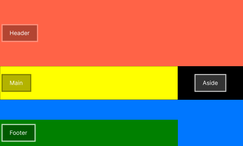
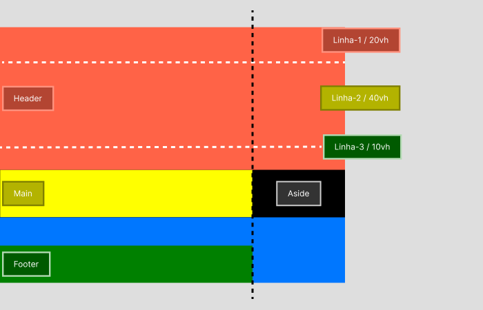

# :books: Exemplo 3

<p>Nesse exemplo foi usado as seguintes propriedades:</p>
<p>    
    :heavy_check_mark: Grid-template-columns;<br>
    :heavy_check_mark: Grid-template-rows;<br>          
    :heavy_check_mark: Grid-column-start;<br>
    :heavy_check_mark: Grid-column-end;<br>
    :heavy_check_mark: Grid-row-start;<br>
    :heavy_check_mark: Grid-row-end;<br>
</p>

---

## :art: Imagem 

### Exemplo 3
#### :package: Container ilustrativo


<p>Nesse exemplo foi definido a quantidade de linhas da tag header, usando a propriedade ( grid-row-start / grid-row-end )e utilizando como parâmetro grid-template-rows: 20vh 40vh 10vh, para determinar o tamanho da linha.</p>



---

## :keyboard: Código simplificado do exemplo

```css
# Exemplo do css 

html {
    /* A cada 1rem será considerado 10px */
    font-size: 62.5%;
}
.container{
    display: grid;
    grid-template-columns:3fr 1fr;
    grid-template-rows:20vh 40vh 10vh 30vh;   
    color:#FFF;
    font-size: 2rem;
}
header{
    grid-column-start:1;
    grid-column-end:3;
    grid-row-start:1; /*Determina o início da linha */
    grid-row-end:4;   /*Determina o fim da linha, mas não ocupa a linha 4 */ 
    background-color: rgb(255, 99, 71);          
}
main{
    height:15rem;    
    background-color:#ffff00;    
}
aside{
    height:15rem;
    background-color:#fff;    
}
footer{    
    height:15rem;
    background-color:#008000;
}
    
```