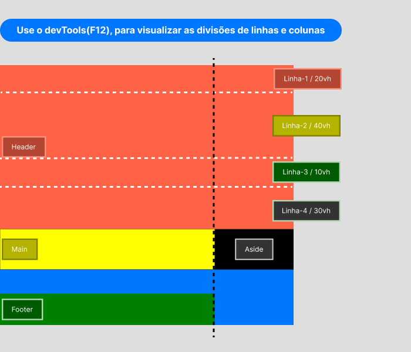
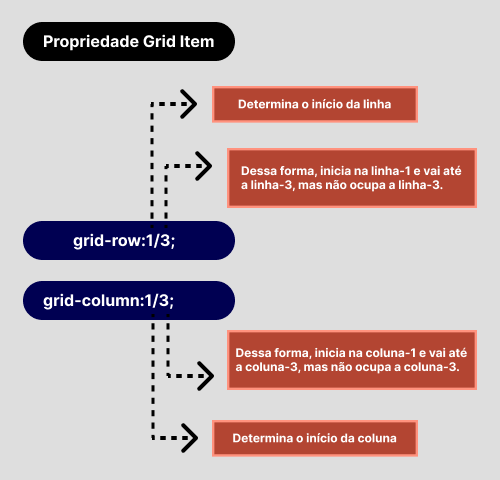

# :books: Exemplo 3.1

<p>Nesse exemplo foi usado as seguintes propriedades:</p>

## :package: Grid Container
<p>    
    :heavy_check_mark: Grid-template-columns;<br>
    :heavy_check_mark: Grid-template-rows;<br>          
    :heavy_check_mark: Grid-column;<br>    
    :heavy_check_mark: Grid-row;<br>    
</p>

## :pencil: Grid Item

<p>        
    :heavy_check_mark: Grid-column;<br>    
    :heavy_check_mark: Grid-row;<br>    
</p>

---

## :art: Imagem 

#### :package: Container ilustrativo


<p>Nesse exemplo foi utilizado as propriedades grid-column e grid-row que são abreviações de (grid-column-start / grid-column-end) e (grid-row-start / grid-row-end).</p>



#### :pencil: Propriedade Grid Item: Grid row / Grid Column



---

## :keyboard: Código simplificado

```css
* {
    margin: 0;
    padding: 0;
    outline: 0;
    box-sizing: border-box;
    background:#0077FF;    
}
html {
    /* A cada 1rem será considerado 10px */
    font-size: 62.5%;
}
.container{
    display: grid;
    grid-template-columns:3fr 1fr;
    grid-template-rows:20vh 40vh 10vh 30vh;   
    color:#FFF;
    font-size: 2rem;
}
header{
    grid-column:1/3; /* Inicia na coluna 1 e termina na coluna 2 */    
    grid-row:1/5;    /* Inicia na linha 1 e termina na linha 4 */
    background-color: rgb(255, 99, 71);          
}
main{
    height:15rem;    
    background-color:#ffff00;    
}
aside{
    height:15rem;
    background-color:black;    
}
footer{    
    height:15rem;
    background-color:#008000;
}
    
```