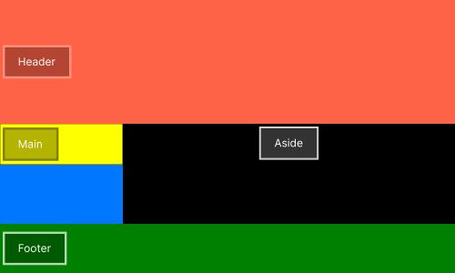
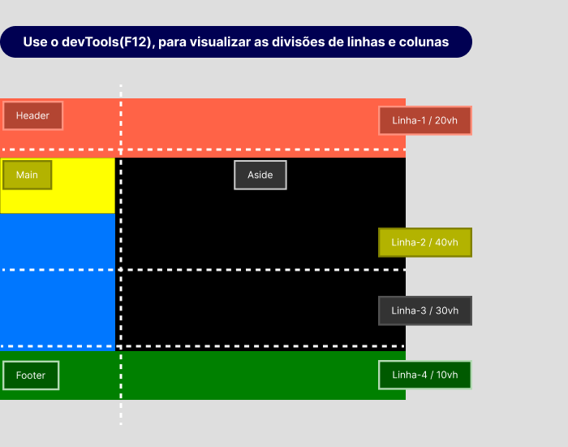

# :books: Exemplo 4

<p>Nesse exemplo foi usado as seguintes propriedades:</p>

## :package: Grid Container

<p>    
    :heavy_check_mark: Grid-template-columns;<br>
    :heavy_check_mark: Grid-template-rows;<br>              
</p>

## :pencil:  Grid Items

<p>                
    :heavy_check_mark: Grid-column-start;<br>
    :heavy_check_mark: Grid-column-end;<br>
    :heavy_check_mark: Grid-row-start;<br>
    :heavy_check_mark: Grid-row-end;<br>
</p>

---

## :art: Imagem 

#### :package: Container ilustrativo


<p>Nesse exemplo foi definido a quantidade de linhas da tag aside, usando a propriedade ( grid-row-start / grid-row-end ) e foi utilizado como parâmetro grid-template-rows: 20vh 40vh 30vh 10vh, para determinar o tamanho da linha.</p>



---

## :keyboard: Código simplificado

```css
* {
    margin: 0;
    padding: 0;
    outline: 0;
    box-sizing: border-box;
    background:#0077FF;    
}
html {
    /* A cada 1rem será considerado 10px */
    font-size: 62.5%;
}
.container{
    display: grid;
    grid-template-columns:1fr 2fr;
    grid-template-rows:20vh 40vh 30vh 10vh;   
    color:#FFF;
    font-size: 2rem;
}
header{
    grid-column-start:1; /* Começa na coluna 1 */
    grid-column-end:3;   /* Termina na coluna 2 */
    background-color: #ff6347;
    height:auto;       
}
main{      
    grid-row-start:2;    
    grid-row-end:4;
    height:15rem;  /* Define o tamanho do elemento diferente do aside que segue o tamanho da linha */  
    background-color:#ffff00;    
}
aside{           
    grid-row-start:2; /* Começa na linha 2 */    
    grid-row-end:4;   /* Termina na linha 3 */
    background-color:black;      
}
footer{
    grid-column-start:1;
    grid-column-end:3;        
    height:15rem;
    background-color:#008000;
}
    
```