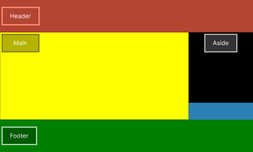

# :books: Exemplo 5

<p>Nesse exemplo foi usado as seguintes propriedades:</p>

## :package: Grid Container
<p>
    :heavy_check_mark: Grid-template-areas;<br>     
    :heavy_check_mark: Grid-template-columns;<br>
    :heavy_check_mark: Grid-template-rows;<br>                              
</p>

## :pencil: Grid Items

<p>                       
    :heavy_check_mark: Grid-column;<br>    
    :heavy_check_mark: Grid-row;<br>    
</p>

---

## :art: Imagem 

#### :package: Container ilustrativo



#### :package: Propriedade Grid Container: Grid Template Areas


#### :pencil: Propriedade Grid Item: Grid row / Grid column (Demonstrativo)


---

## :keyboard: Código simplificado

```css
* {
    margin: 0;
    padding: 0;
    outline: 0;
    box-sizing: border-box;
    background:#0077FF;    
}
html {
    /* A cada 1rem será considerado 10px */
    font-size: 62.5%;
}
.container {
    display: grid;    
    grid-template-areas: "header header"
                         "main aside"       
                         "footer footer";
    grid-template-columns:3fr 1fr;
    grid-template-rows:20vh 40vh 10vh 30vh;                           
    color:#FFF;
    font-size: 2rem;
}
header {
    /* grid-column: 1-column-start / 3-column-end */        
    grid-column:1/3;
    grid-row:1/2;
    background-color: rgb(255, 99, 71);          
}
main {            
    grid-column: 1/2;
    grid-row: 2/4;
    background-color:#ffff00;    
}
aside {            
    background-color:black;    
}
footer {              
    grid-column: 1/3;
    background-color:#008000;
}
```