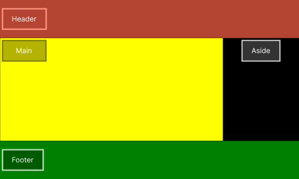
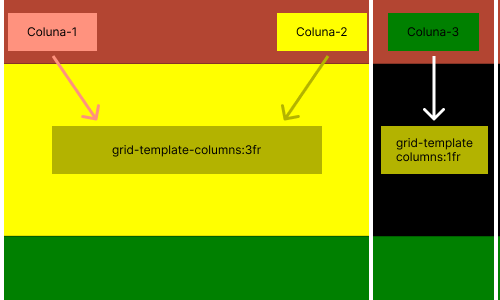
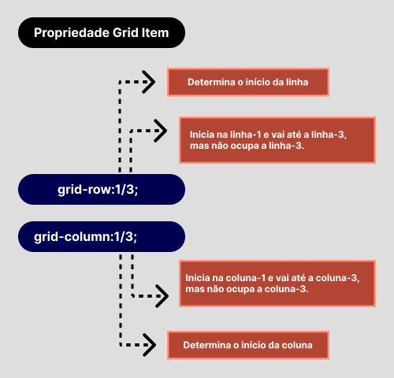
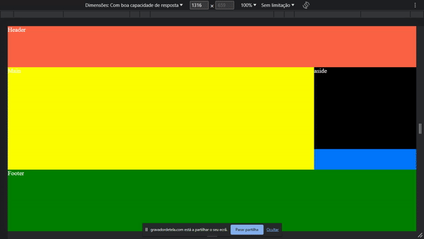

# :dart: Resumo do Grid CSS :dart:

<p>
    :small_blue_diamond: Um recurso do CSS que permite desenvolver layouts em grid;<br>
    :small_blue_diamond: É um valor da propriedade display;<br>
    :small_blue_diamond: Os grids são divididos em colunas e linhas;<br>
    :small_blue_diamond: Os recursos do flex-box podem ser usados em grid;<br>
    :small_blue_diamond: O container controla a disposição dos itens, mas os itens também podem alterar o seu posicionamento;
</p>

---

## :toolbox: Principais Propriedades Grid CSS :hammer_and_wrench: <br><br>

### :package: Propriedades Grid Container

<p>
    :heavy_check_mark: Display grid;<br>
    :heavy_check_mark: Grid-template-columns;<br>       
    :heavy_check_mark: Grid-template-areas;<br>        
    :heavy_check_mark: Grid-gap;<br>        
</p>

### :pencil: Propriedades Grid Items

<p>     
    :heavy_check_mark: Grid-column;<br>    
    :heavy_check_mark: Grid-row;<br>
    :heavy_check_mark: Grid-area;<br> 
    :heavy_check_mark: Justify-self;<br> 
    :heavy_check_mark: Align-self;<br> 
</p>  

---

## :art: Imagem 

### Exemplo 1.1
#### :package: Container ilustrativo



### Exemplo 1.2

#### :package: Container com :classical_building: 2 colunas



#### :package: Propriedade Grid Container / Grid Item :pencil:


#### :pencil: Propriedade Grid Item: Grid row / Grid column (Demonstrativo)



## :keyboard: Código simplificado Grid-template-areas | :open_file_folder: 03-aula/01-ex

```css
* {
    margin: 0;
    padding: 0;
    outline: 0;
    box-sizing: border-box;
    background:#0077FF;    
}
html {
    /* A cada 1rem será considerado 10px */
    font-size: 62.5%;
}
.container{
    width: 100vw;
    height: 100vh;
    display: grid;
    grid-template-areas: 
        "left right"
        "footer footer"
    ;
    grid-template-columns:1fr 1fr;
    grid-template-rows:4fr 1fr;
    color:#FFF;
    font-size: 4rem;    
}

/*========= Media queries ============*/

@media screen and (max-width: 820px){
    .container {
        grid-template-areas: 
        "left"    /* Linha-1 */
        "right"   /* Linha-2 */
        "footer"; /* Linha-3 */
        grid-template-columns: 1fr;
    }    
}

@media screen and (max-width: 480px) {
    .nav-left {
        display: none;
    }
    .container {
        grid-template-areas: 
            "right"   /* Linha-1 */
            "footer"  /* Linha-2 */
        ;
    }
}

```

## :open_file_folder: 03-aula/01-ex 


---

## :keyboard: Código simplificado Grid-template-areas | Grid-column |Grid-row |:open_file_folder: 01-aula/08-ex

```css
* {
    margin: 0;
    padding: 0;
    outline: 0;
    box-sizing: border-box;
    background:#0077FF;    
}
html {
    /* A cada 1rem será considerado 10px */
    font-size: 62.5%;
}
.container {
    display: grid;    
    grid-template-areas: "header header"    /*Linha 1*/
                         "main aside"       /*Linha 2*/
                         "footer footer";   /*Linha 3*/
    grid-template-columns:3fr 1fr;
    grid-template-rows:20vh 40vh 10vh 30vh;                           
    color:#FFF;
    font-size: 2rem;
}
header {
   /* grid-column: 1-column-start / 3-column-end */        
    grid-column:1/3;
    grid-row:1/2;
    background-color: rgb(255, 99, 71);          
}
main {            
    grid-column: 1/2;
    grid-row: 2/4;
    background-color:#ffff00;    
}
aside {            
    background-color:black;    
}
footer {              
    grid-column: 1/3;
    background-color:#008000;
}


```
## :open_file_folder: 01-aula/08-ex



